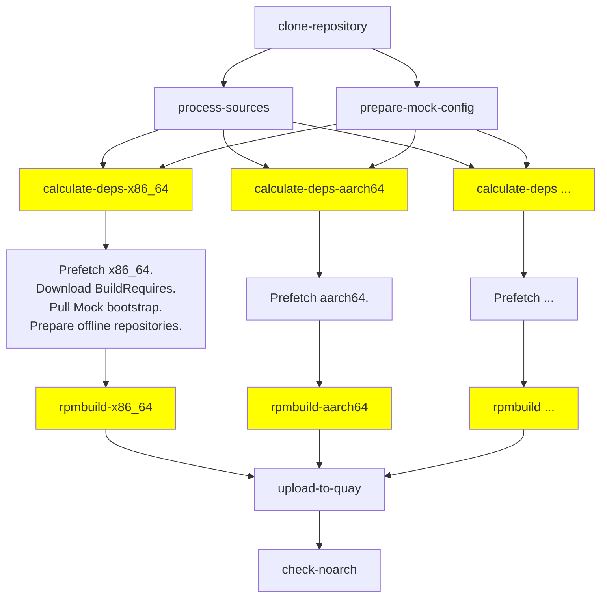

# RPM Build Pipeline Architecture

In short, the RPM Build Pipeline builds on top of existing tooling that Fedora,
CentOS, and RHEL maintainers are familiar with—namely, it obtains source code
from [DistGit][] and builds using [Mock][].

This brings us a lot of convenience, because people can (continue to) work with
package Git repositories the way they are used to—and, for example, easily
reproduce builds locally.

People often ask why we use Mock in a "container-native" build system.  The
short answer is that Mock actually brings *a lot* of convenience.  And note
this: **Mock is a container-native tool** nowadays!  For more info, check the
[Why Mock][] document.

## Basic pipeline flow

The chart below illustrates the current Tekton Task flow used in the RPM Build
Pipeline.

The yellow boxes represent architecture-specific tasks.  This means that, for
example, `rpmbuild-x86_64` Task must be executed in a native `x86_64`
environment.  Konflux needs to allocate a virtual machine for this task
using [MPC][].

## Steps

- **clone-repository**
    - This step is architecture-agnostic and is executed only once.
    - Typically, we clone the package source from a DistGit repository or a fork.
    - A full clone is required (to keep [rpmautospec][] happy).
- **process-sources**
    - Downloads the precise set of source files (typically tarballs) from the
      corresponding DistGit lookaside cache.
    - This task provides a "frozen" set of source files for the subsequent RPM
      builds.  The output from this task (see the ociStorage parameter)
      represents the final set of source code files that will *exclusively*
      affect the resulting built artifacts.  Special attention is paid to
      ensuring the user can never take control of the execution in this task to
      introduce unexpected code.
    - We also remove the `.git` repository here to ensure that historical code
      artifacts do not affect the output of the build.
    - Any additional code pre-processing must happen here, under *our control*
      (not user's), e.g., we expand rpmautospec `%autorelease` and
      `%autochangelog` templates here.
- **prepare-mock-config**
    - Given the input parameters and the source directory (some use cases allow
      the Pipeline to read the Mock config file from cloned sources), generate a
      Mock configuration template file.  The template is architecture-agnostic;
      tasks that use this template need to instantiate it with their own
      architecture string (e.g., `s/@ARCH@/x86_64/`).
- **calculate-deps-&lt;ARCH&gt; (Mock)**
    - This step **is not** [hermetic][].  However, it is necessary in order to
      build hermetically in the subsequent **rpmbuild-&lt;ARCH&gt;** step.
    - This step is architecture-specific (executed multiple times, for each
      selected architecture).
    - Starts `rpmbuild` (via Mock) to extract sources and calculate dynamic build
      requirements (see [%generate_buildrequires][]).
    - Generates a lockfile listing the required RPMs to be downloaded.
    - The lockfile is one of the sources artifacts used for producing SBOM.
- **prefetch &lt;ARCH&gt;**
    - Downloads RPMs (BuildRequires) listed in the lockfile to prepare a local,
      "offline" RPM repository.
    - **TODO**: While this step is not architecture-specific, it's currently
      "bundled" into the previous `calculate-deps-*` Task and should be
      separated (see progress on [issue#48][]).
- **rpmbuild-&lt;ARCH&gt; (Mock)**
    - This step **is** [hermetic][].
    - Produces a list of "binary" RPMs (built artifacts).
- **upload-to-quay**
    - Collects all built artifacts from previous steps and uploads them to
      OCI registry (the destination is selected by the user as a pipeline
      parameter).
    - If config for [pulp cli][] is setup as a secret using pulp-config secret name,
      Pulp will upload RPMs, logs, and SBOM to a configured pulp domain.
      In the secert will need to be a file called oauth-cli.toml. This will need to contain
      the pulp config toml. It accepts either certs or oauth. If using certs to do
      authentication, the certs will need to be included in the secret.
- **check-noarch**
    - Verifies that all noarch (sub-)packages from the architecture-specific
      builds are identical.  If they are not, the step fails the pipeline.
      Noarch sub-packages are built on all architectures, but typically, we want
      to de-duplicate and distribute only one of them.

[%generate_buildrequires]: https://github.com/rpm-software-management/mock/issues/1359
[MPC]: https://github.com/konflux-ci/multi-platform-controller
[rpmautospec]: https://github.com/fedora-infra/rpmautospec
[hermetic]: https://rpm-software-management.github.io/mock/feature-hermetic-builds
[Why Mock]: https://rpm-software-management.github.io/mock/Why-Mock
[Mock]: https://rpm-software-management.github.io/mock/
[DistGit]: https://github.com/release-engineering/dist-git
[pulp cli]: https://pulpproject.org/pulp-cli/docs/user/guides/configuration/
[issue#48]: https://github.com/konflux-ci/rpmbuild-pipeline/issues/48
